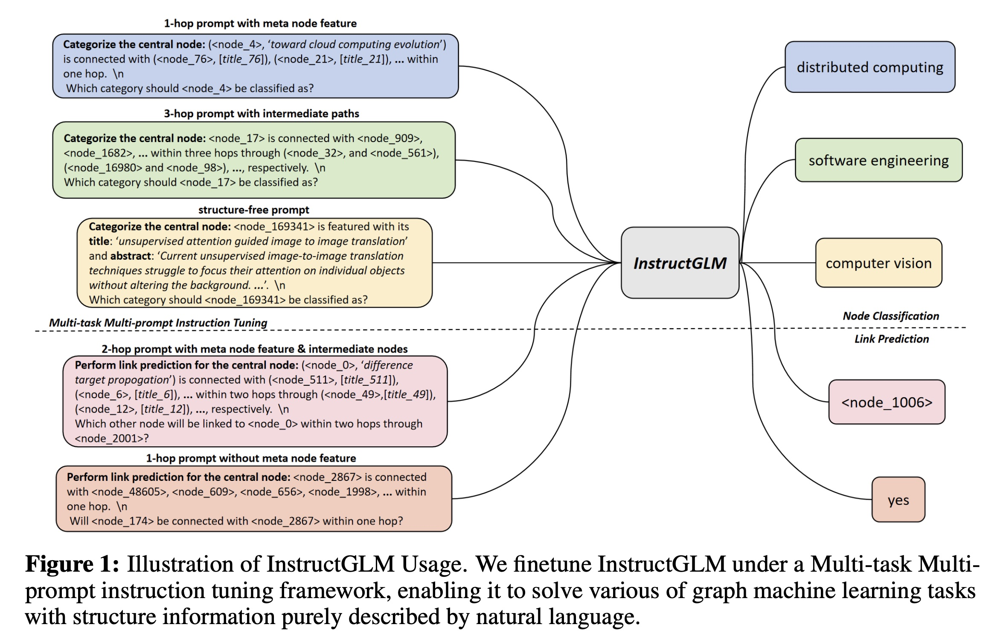
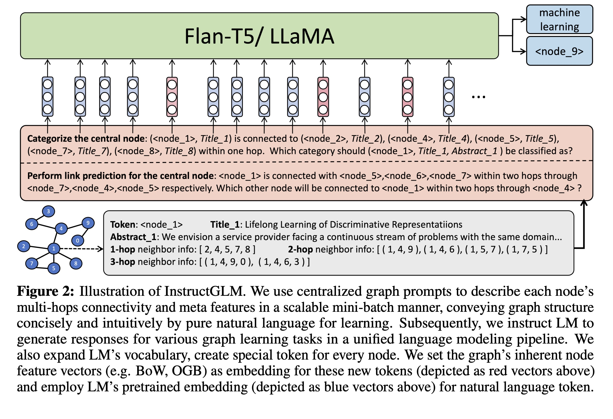

# LLM / Graph AI / Knowledge Graph Experiments for Natural Language is all a Graph Needs

This project contains experiments on the ideas introduced in [Natural Language is all a Graph Needs](https://arxiv.org/abs/2308.07134) by [Ruosong Ye](https://www.linkedin.com/in/ruosong-ye-a0507724b/), [Caiqi Zhang](https://www.linkedin.com/in/caiqi-alex-zhang-%E5%BC%A0%E8%94%A1%E5%90%AF-99074519b/), [Runhui Wang](https://www.linkedin.com/in/runhui-wang/), [Shuyuan Xu](https://www.linkedin.com/in/shuyuan-xu-870206158/) and [Yongfeng Zhang](https://www.linkedin.com/in/zhangyongfeng/). LLMs have achieved such ease of use that the authors of the paper were able to release _just the prompts_ used for training rather than the entire codebase. This project is an attempt to reproduce the results of the paper and to explore the ideas introduced in the paper further via applied research into applying it to real-world problems such as entity resolution.

## Significance

I have followed the development of Graph Neural Networks (GNNs) for the last three years. **This paper is very surprising to me.** I need to understand what it means. My goal is to use and extend this techology to create a robust, topology aware, generic entity resolution model in weeks that took a year using BERT, Google Grale and a binary classifier model with feature engineering. A GNN version of our model was merely aspirational. 

## Blog Post Series

This work comes from a 3-part [or maybe 4-part] series of LinkedIn Articles:

* [LLMs-represent->Knowledge Graphs](https://www.linkedin.com/pulse/instructglm-knowledge-graphsrepresentedbyllms-russell-jurney/?trackingId=slyb9SVqTeemAVP8d4Zz5Q%3D%3D) - 9/1/23 - describes InstructGLM and announcs my intention to reproduce and extend it to entity resolution problems.
* Topology Aware Prompt Engineering: OpenAI is all a Graph Needs? [unfinished]

## Essential Figures

To understand the paper, take a quick look at the following figures:

## Instruction Prompts (Appendix A.1)

The paper's authors released their instruction prompts on arXiv on August 14, 2023 while their code is due out in October when their paper is formally published. Therefore I have copied the prompts from the paper PDF to use in this project. They belong to the authors. I will modify them for my own purposes.

### Markdown Format

Prompts were [lovingly <3] rewritten in Markdown format in [prompts.md](prompts.md) [incomplete].

### Python Prompt Generation

Markdown prompts are then parsed in [marko](https://marko-py.readthedocs.io/en/latest/) and converted into LangChain prompts via [LangChain Decorators](https://python.langchain.com/docs/integrations/providers/langchain_decorators). I wonder - is this a general pattern?

Copied from the paper, the specification for the instruction prompts included in [prompts.md](prompts.md) are as follows:

_In this appendix, we present all our designed instruction prompts. It is worth noting that we follow
the following conventions when numbering the prompts:_

- _The length of each prompt number is 4._
- _The first digit represents the task index, where 1 represents the node classification task and 2 represents the link prediction task._
- _The second digit represents whether node features or edge features (such as text information) other than numerical feature embedding are used in the prompt. 1 means not used and 2 means used._
- _The third digit represents the maximum hop order corresponding to the structural information considered in this prompt. 1 represents only the 1-hop neighbors are included, while 2 and 3 represent the structural information including 2-hop and 3-hop neighbors, respectively._
- _The fourth digit represents whether the intermediate node information (i.e. the path) in the highorder connection is considered in this prompt. If the digit is even, it means that the intermediate
node is considered, while an odd digit indicates otherwise._
- _Specially, in node classification task, we designed a graph-structure-free prompt and numbered it as 1-0-0-0._
